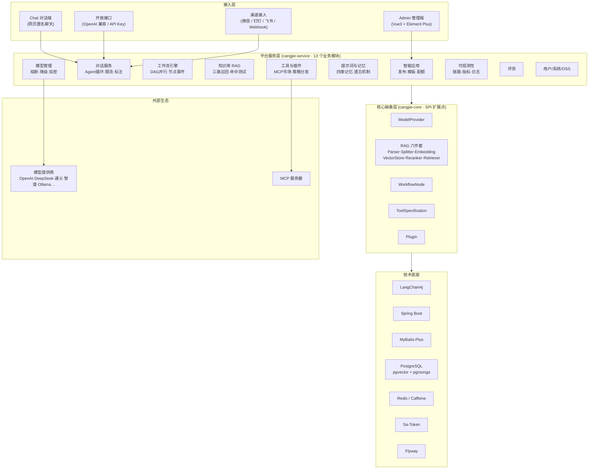
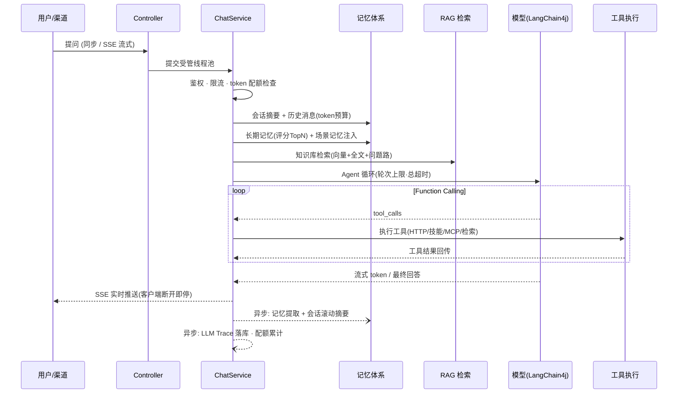

# CangJie Agent — 仓颉智能体平台

> 企业级大模型智能体（Agent）平台，一站式构建、部署、运营 AI 应用。


---

> 在 AI 浪潮席卷全球的今天，Java 程序员却始终处在一种尴尬的境地：Python 拥有 LangChain、LlamaIndex，JavaScript 有 Vercel AI SDK，而 Java 世界却长期缺乏一个真正属于自己的、企业级的 AI 框架。没有统一抽象、没有原生 RAG 引擎、没有可视化工作流编排——每一次想做 AI 应用，都要从零拼凑、重复造轮子。作为常年深耕企业级开发的 Java 开发者，这种“不容易”我感同身受：在技术选型上被边缘化，在框架生态上被忽视，在 AI 浪潮中默默承受着“没有自己框架”的无奈。
>
> 正因为如此，我决定做这样一件事：**为 Java 程序员，造一个真正好用的 AI 平台**——不是简单封装 Python 接口，而是从 Spring Boot、MyBatis-Plus、PostgreSQL 这些熟悉的技术栈出发，构建一个完整的、可扩展的、企业级的智能体平台。**CangJie Agent** 就是这份努力的答案。

---

## 📖 简介

CangJie Agent 是一个面向企业级场景的 AI 智能体平台，后端基于 **Spring Boot 3 + Java 17**，前端基于 **Vue 3 + TypeScript + Vite**。平台提供了大模型管理（熔断降级）、知识库（三路混合 RAG）、四层记忆体系、工作流编排、MCP 工具市场、提示词管理、智能应用发布、多渠道接入、可观测性与配额限流等能力，帮助企业快速构建和运营 AI 应用。

---

## 🧩 系统架构



### 一次对话请求的完整链路



### 模块结构

```
cangjie-agent
├── cangjie-common          -- 公共基础：统一返回、异常、AES 加密、令牌桶限流器、MP 基类
├── cangjie-core            -- 核心抽象：模型提供者、RAG 引擎、工作流节点、工具、插件 SPI
├── cangjie-service-api     -- API 契约层（各业务模块 DTO）
├── cangjie-service         -- 业务实现层（13 个模块）
│   ├── cangjie-user        -- 用户认证 + RBAC 权限
│   ├── cangjie-model       -- 大模型管理（密钥加密、熔断降级、热更新缓存）
│   ├── cangjie-knowledge   -- 知识库（文档解析、批量向量化、混合检索、问题管理）
│   ├── cangjie-tool        -- 工具与插件（策略分发、MCP 工具市场）
│   ├── cangjie-prompt      -- 提示词、技能、规则、记忆体系与遗忘任务
│   ├── cangjie-workflow    -- 工作流引擎（DAG 并行、节点事件持久化、异步执行）
│   ├── cangjie-application -- 智能应用（发布、配额、模板）
│   ├── cangjie-chat        -- 对话服务（Agent 循环、SSE 流式、限流、反馈标注）
│   ├── cangjie-trigger     -- 渠道接入（微信等）
│   ├── cangjie-oss         -- 文件存储 + 操作日志
│   ├── cangjie-observability -- 可观测性（LLM Trace、Prometheus 指标）
│   ├── cangjie-eval        -- 知识库/应用评测
│   └── cangjie-system      -- 系统设置
├── cangjie-api             -- 对外开放接口层（OpenAI 兼容协议）
├── cangjie-start           -- 启动入口 + Flyway 迁移 + 全局配置 + 线程池
└── cangjie-agent-ui        -- 前端（Admin 管理端 + Chat 对话端）
```

---

## ✨ 核心功能

### 🤖 大模型管理
多模型提供商接入（OpenAI 兼容接口），模型参数配置、在线测试、默认模型设置。API Key **AES 加密存储**、展示脱敏。内置**模型熔断降级**：连续失败自动熔断，冷却期内透明降级到备用模型，半开探测自动恢复。

| 模型管理 |
|:---:|
|  |

### 📚 知识库（RAG）
- **多格式文档解析**：PDF、Word、Excel、PPT、图片、纯文本
- **异步处理管线**：上传即返回，后台"解析→切片→批量向量化"，失败可重新处理
- **混合检索三路召回**：向量相似度（pgvector）+ 全文检索（pgroonga）+ **问题路召回**
- **问题管理**：段落关联常见问题，检索命中问题即高置信返回
- **两级检索**：文档摘要粗筛 → 段落精准检索（two-stage）
- **命中测试**：查看每条结果的向量分/全文分/问题命中，调试召回效果

| 知识库 |
|:---:|
|  |

### 🧠 记忆体系
四类记忆协同，模拟人类记忆的工作方式：

| 记忆类型 | 机制 | 生命周期 |
|---|---|---|
| **短期记忆** | 会话历史，按 token 预算截断（保底最新一轮） | 请求内 |
| **会话记忆** | 每累计 N 条消息异步滚动摘要，历史加载时注入 | 会话内 |
| **场景记忆** | 对话中自动提取会话级事实，绑定会话注入 | 会话绑定 |
| **长期记忆** | 用户画像四维度（偏好/背景/习惯/目标）LLM 提取去重 | 跨会话 |

**遗忘机制**：`score = 置信度 × 时近衰减(半衰期) × 触发强度`——低分自动软遗忘、超容量按分淘汰；常用记忆越强，人工录入的记忆永不遗忘。管理端支持查看、编辑、停用/激活、删除。

### 🔧 工具与插件
可注册外部工具和插件扩展 Agent 能力边界。策略分发架构（HTTP / 自定义 / 技能 / MCP / 插件五类处理器），统一参与 Function Calling。

**MCP 工具市场**：注册 MCP 服务器 → 连通性测试 → 自动发现工具 → 一键同步为平台工具，应用直接绑定使用。

| 工具和插件 |
|:---:|
|  |

### 💬 提示词管理
管理提示词模板、命令（Command）、规则（Rule）、技能（Skill）、记忆（Memory）。

| 提示词管理 |
|:---:|
|  |

### ⚙️ 工作流引擎
可视化拖拽编排，DAG 拓扑排序 + 按轮次并行执行，9 种内置节点：开始 / 结束 / LLM 调用 / 知识库检索 / 工具调用 / 条件判断 / 循环 / API 请求 / 代码执行。

- **同步 + 异步双模式**：异步执行立即返回 executionId，轮询查询进度
- **节点级执行事件持久化**：每个节点的耗时、输入输出、成败全程留痕
- **节点级重试**：指数退避，配置化

| 工作流编排 |
|:---:|
|  |

### 🚀 智能应用
将模型、知识库、提示词、工作流组装为可对外发布的 AI 应用，一键发布，独立 API Key。

- **应用模板**：成熟应用沉淀为模板，一键克隆创建（含全部配置快照）
- **token 配额**：按应用设置配额，用尽自动拦截，用量实时累计
- **请求限流**：令牌桶按应用维度限 QPS，防止单应用打满资源

| 智能应用 |
|:---:|
|  |

### 💬 对话运营
- 同步 + SSE 流式双通道，兼容 OpenAI Chat Completions 协议
- **对话反馈**：用户对 AI 回复点赞 / 点踩
- **人工标注**：修正 AI 答案，形成运营改进闭环
- 回答附引用来源（retrieval sources 随消息返回）

### 📡 可观测性与可靠性
- **LLM 全链路追踪**：每次模型调用的输入输出、token、耗时、成败落库
- **操作日志**：AOP 全量写操作审计，敏感字段自动脱敏
- **Prometheus 指标**：`/actuator/prometheus` 暴露 JVM / HTTP / 业务指标
- **traceId 贯穿**：线程池任务装饰器保证异步场景链路不断
- **全链路超时**：LLM 调用超时、Agent 循环总超时、SSE 超时，均可配置
- **优雅降级**：模型熔断降级、知识库检索失败不阻塞对话、客户端断开即停止后台推流

| 链路追踪 |
|:---:|
|  |

### 🔐 权限与安全
基于 Sa-Token 的用户-角色-菜单三级权限体系，JWT 令牌认证；知识库支持**私有/公开可见性**与创建者数据权限；模型密钥加密；开放接口 API Key 独立管控。

### 📁 文件管理
支持本地存储与 MinIO 对象存储，统一管理平台中的文件资产。

---

## 🛠️ 技术栈

### 后端

| 技术 | 版本 | 用途 |
|------|------|------|
| Java | 17 | 开发语言 |
| Spring Boot | 3.4.1 | 核心框架 |
| MyBatis-Plus | 3.5.9 | ORM |
| PostgreSQL | 16 + pgvector + pgroonga | 数据库 + 向量检索 + 全文检索 |
| Flyway | 11.0.0 | 数据库迁移 |
| Sa-Token | 1.39.0 | 认证与授权 |
| LangChain4j | 1.18.1 | AI 集成（模型 / 流式 / Function Calling） |
| MinIO | 8.5.17 | 对象存储 |
| Caffeine / Redis | — | 缓存 / 会话存储 |
| Micrometer + Prometheus | — | 指标暴露 |
| Knife4j + SpringDoc | — | API 文档 |
| Apache PDFBox / POI | — | 文档解析 |
| OkHttp | — | 工具调用 / MCP 通信 |

### 前端

| 技术 | 版本 | 用途 |
|------|------|------|
| Vue 3 | 3.5.13 | 前端框架 |
| TypeScript | ~5.8 | 类型安全 |
| Vite | 6.2.4 | 构建工具 |
| Element Plus | 2.13.5 | UI 组件库 |
| Vue Flow | 1.48.2 | 工作流可视化 |
| ECharts | 5.6.0 | 数据可视化 |
| Pinia | 2.3.1 | 状态管理 |
| Axios | 1.8.4 | HTTP 请求 |

---

## 🚀 快速启动

### 环境要求

| 依赖 | 版本 |
|------|------|
| JDK | 17+ |
| Maven | 3.8+ |
| Node.js | 18+ |
| PostgreSQL | 16+（需安装 pgvector、pgroonga 扩展） |
| Redis | 6+ |

### 后端启动

```bash
# 1. 克隆项目
git clone <repo-url>
cd cangjie-agent

# 2. 编译
mvn clean compile -pl cangjie-start -am -DskipTests

# 3. 配置数据库（修改 application-dev.yml 中的连接信息）

# 4. 生产环境务必设置环境变量
#    export CANGJIE_MODEL_KEY_SECRET=<模型密钥加密密钥>
#    export SA_TOKEN_JWT_SECRET_KEY=<JWT 密钥>
#    export SYSTEM_DEFAULT_PASSWORD=<管理员初始密码>

# 5. 启动（Flyway 自动执行数据库迁移）
mvn spring-boot:run -pl cangjie-start -DskipTests
```

### 前端启动

```bash
cd cangjie-agent-ui
npm install
npm run dev
```

访问 `http://localhost:5173` 进入 Admin 管理端。

### Docker 部署

```bash
docker compose up -d
```

---

## ⚙️ 核心配置

平台配置集中在 `cangjie.*` 命名空间（`cangjie-start/src/main/resources/application.yml`）：

| 配置项 | 默认值 | 说明 |
|---|---|---|
| `cangjie.model.timeout-seconds` | 120 | 单次 LLM 请求超时（同步/流式/嵌入） |
| `cangjie.model.breaker.*` | 开 / 5 次 / 30s | 模型熔断阈值与冷却时间 |
| `cangjie.model.fallback-model-id` | — | 熔断时指定的降级模型 |
| `cangjie.chat.sse-timeout-seconds` | 600 | SSE 连接超时 |
| `cangjie.chat.agent.max-rounds` | 5 | Function Calling 最大轮次 |
| `cangjie.chat.agent.timeout-seconds` | 300 | Agent 循环总超时 |
| `cangjie.chat.history.max-tokens` | 6000 | 短期记忆 token 预算 |
| `cangjie.chat.session.summary-every` | 10 | 会话滚动摘要触发间隔（条） |
| `cangjie.memory.inject.max-count` | 20 | 记忆注入条数上限（按评分取 TopN） |
| `cangjie.memory.decay.*` | 每日 03:00 | 遗忘任务：阈值 0.25 / 半衰期 30 天 / 容量 100 |
| `cangjie.ratelimit.qps` / `burst` | 5 / 10 | 按应用的对话限流 |
| `cangjie.security.model-key-secret` | — | 模型 API Key 加密密钥（生产必改） |
| `cangjie.openapi.web-anonymous` | true | 网页匿名聊天开关 |
| `cangjie.workflow.execution.retry.*` | 3 次 / 指数退避 | 工作流节点重试 |
| `cangjie.rag.query-rewrite.*` | 关 | 检索查询改写 |

---

## 📡 开放接口

| 端点 | 说明 |
|---|---|
| `POST /api/open/chat/completions` | OpenAI 兼容对话（支持 stream），`Authorization: Bearer <apikey>` |
| `POST /v1/chat/completions` | OpenAI 兼容协议端点 |
| `POST /chat/**/send`、`/send-stream` | 平台对话接口（X-API-Key 鉴权） |
| `POST /api/open/chat/stream` | 网页匿名流式聊天 |
| `POST /admin/workflow/{id}/execute/async` | 工作流异步执行 |
| `GET /actuator/prometheus` | Prometheus 指标抓取 |

完整接口文档：启动后访问 `/swagger-ui.html`（Knife4j）。

---

## 🔌 企业快速接入

平台提供三种接入方式，覆盖从"零代码"到"深度集成"：

**方式一：一行挂件（零代码，适合官网客服）**

把一行代码粘贴到企业网站 `</body>` 前即可出现浮动聊天窗口：

```html
<script src="http://你的平台地址/widget/cangjie-widget.js"
        data-app-id="应用ID"
        data-title="在线客服"
        data-color="#4f7cff"></script>
```

**方式二：iframe 嵌入（适合内部系统）**

```html
<iframe src="http://你的平台地址/api/open/embed/{应用ID}" width="400" height="600"></iframe>
```

嵌入页是无外部依赖的单文件系统，自带流式输出、快捷提问、会话保持。

**方式三：OpenAPI（适合深度集成）**

OpenAI Chat Completions 协议兼容，业务系统改一个 `base_url` 即可接入：

```bash
curl http://平台地址/api/open/chat/completions \
  -H "Authorization: Bearer <应用apikey>" \
  -H "Content-Type: application/json" \
  -d '{"model":"cangjie","messages":[{"role":"user","content":"你好"}],"stream":true}'
```

> 嵌入页与匿名聊天受 `cangjie.openapi.web-anonymous` 开关控制，生产环境可按安全策略关闭，仅保留 API Key 接入。

### 🎁 官方模板库

平台内置 8 个开箱即用模板（智能客服、企业知识库问答、营销文案、代码评审、会议纪要、双语翻译、NL2SQL、工作流客服示例），启动时自动导入（`cangjie.templates.import-builtin` 可关）。

- **Bundle 结构**：模板 = 应用配置 + 提示词模板 + 工作流定义，一键创建时级联生成全部资源并自动绑定
- **沉淀与流通**：任何应用可"存为模板"；模板支持导出/导入 JSON，跨环境迁移
- 官方模板按 `templateKey` 幂等导入，版本升级自动覆盖，用户自建模板不受影响

---

## 🧪 开发路线

- [x] 大模型管理与调用（熔断降级 / 密钥加密）
- [x] 知识库（RAG）三路混合检索 + 问题管理 + 命中测试
- [x] 四层记忆体系（短期 / 会话 / 场景 / 长期）与遗忘机制
- [x] 可视化工作流编排（并行 DAG / 异步执行 / 节点事件）
- [x] 工具与插件 SPI + MCP 工具市场
- [x] 提示词 / 技能 / 规则管理
- [x] 智能应用发布 + 应用模板 + 配额限流
- [x] 对话反馈与人工标注
- [x] 多渠道接入
- [x] RBAC 权限 + 知识库数据权限
- [x] 可观测性（链路追踪 / 操作日志 / Prometheus）
- [x] 文件管理（本地 + MinIO）
- [ ] 工作流节点扩充（意图识别 / 参数提取 / 真循环）
- [ ] 资源级授权（模型 / 应用授权到人）
- [ ] 对话记录导出与批量运营
- [ ] 更多渠道插件与 Web 站点数据源同步

---

## 📄 开源协议

Copyright © 2025 CangJieCloud. All rights reserved.
